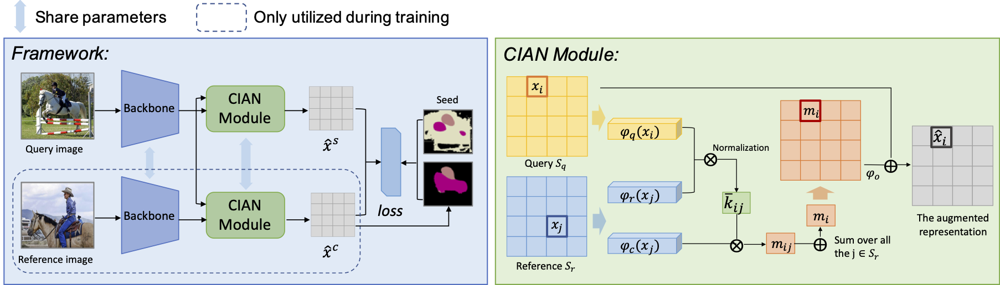

# CIAN: Cross-Image Affinity Net for Weakly Supervised Semantic Segmentation

This is the code of:

CIAN: Cross-Image Affinity Net for Weakly Supervised Semantic Segmentation, Junsong Fan, Zhaoxiang Zhang, Tieniu Tan, Chunfeng Song, Jun Xiao, AAAI2020 [[paper]](https://arxiv.org/abs/1811.10842).

## Introuduction



Framework of the approach. Our approach learns the cross image relationships to help weakly-supervised semantic segmentation. The CIAN Module takes features as input from two different images, extract and change information across them to augment the original features.


## Prerequisite

- Python 3.7, MXNet 1.3.1, Numpy, OpenCV, [pydensecrf](https://github.com/lucasb-eyer/pydensecrf).
- NVIDIA GPUs


## Usage

#### Prepare the dataset and pretrain parameters:

- Download the VOC 2012 dataset, and config the path accordingly in the `run_cian.sh`.

- Download the seeds from [here](https://drive.google.com/open?id=1w2WIEtQe2F1tgxlINpk5mi-BlL_gue8z), untar and put the folder `CIAN_SEEDS` into `CIAN/data/Seeds/` . We use the VGG16 based [CAM](http://cnnlocalization.csail.mit.edu/Zhou_Learning_Deep_Features_CVPR_2016_paper.pdf) to generate the foreground and the saliency model [DRFI](https://github.com/playerkk/drfi_cpp) to generate the background. You can also generate the seeds by yourself.

- Download the ImageNet pretrained parameters and put them into the folder `CIAN/data/pretrained`. We adopt the models provided by the official MXNet [modelzoo](https://github.com/apache/incubator-mxnet/blob/master/example/image-classification/common/modelzoo.py):
  - ResNet101 [http://data.mxnet.io/models/imagenet/resnet/101-layers/resnet-101-0000.params]
  - ResNet50 [http://data.mxnet.io/models/imagenet/resnet/50-layers/resnet-50-0000.params]

#### Run:

```bash
./run_cian.sh
```

This script will automatically run the  training, testing (on val set), and retraining pipeline. Checkpoints and predictions will be saved in folder `CIAN/snapshot/CIAN`.


## Citation

If you find the code is useful, please consider citing:

```
@inproceedings{fan2020cian,
  title={CIAN: Cross-Image Affinity Net for Weakly Supervised Semantic Segmentation},
  author={Fan, Junsong and Zhang, Zhaoxiang and Tan, Tieniu and Song, Chunfeng and Xiao, Jun},
  booktitle={Proceedings of the AAAI Conference on Artificial Intelligence},
  year={2020}
}
```

 


